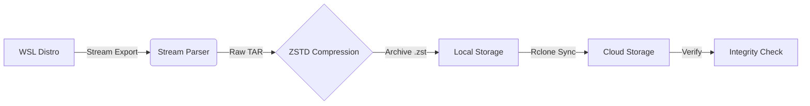

# wsl-automated-backup
Automated, compressed, and cloud-synced backup for WSL.

# 🛡️ WSL Automated Backup System

> A professional-grade, "set-and-forget" disaster recovery pipeline for Windows Subsystem for Linux (WSL).

**Current Status:** v1.0 (Production Ready)

## 📖 Overview

Standard WSL backups (`wsl --export`) are opaque, uncompressed, and manual. This system automates the entire lifecycle of a backup, treating your development environment like a production server.

It orchestrates **Export**, **Compression**, **Cloud Upload**, and **Verification** into a single command, featuring a custom-built stream parser to provide real-time progress feedback.

## 🚀 Key Features

* **📊 Live Stream Parsing:** Intercepts the raw byte stream from `wsl --export` to calculate and display a real-time progress bar (a feature missing from native WSL tools).
* **🗜️ High-Ratio Compression:** Uses **ZSTD (Facebook Zstandard)** to achieve ~60-70% reduction in size.
    * *Benchmark:* Reduced a **4.5GB** Ubuntu image to **1.5GB** (2.99x ratio) in ~3 minutes.
* **☁️ Cloud Synchronization:** deeply integrated with **Rclone** to push backups to Google Drive, OneDrive, or S3.
* **🔒 Integrity Verification:** Automatically compares local and cloud file hashes/sizes to ensure zero corruption.
* **♻️ Retention Policies:** Enforces separate rotation schedules for Local (e.g., 3 days) and Cloud (e.g., 7 days) storage.

## 🛠️ Architecture

The system operates as a layered pipeline:



## ⚙️ Configuration

The system is controlled by a simple `config.json` file, separating logic from data:

```json
{
    "backupDir": "C:\\WSL-Backups",
    "distroName": "Ubuntu",
    "rcloneRemote": "gdrive:WSL-Backups",
    "retentionLocal": 3,
    "retentionCloud": 7
}
```

## 📦 Installation & Prerequisites

### Requirements

* **Windows 10/11** with WSL2 enabled.
* **PowerShell 5.1** or newer.
* **[ZSTD](https://github.com/facebook/zstd)** (available via `winget install zstd`).
* **[Rclone](https://rclone.org)** (configured with a remote).

### Setup

1. Clone this repository.
2. Edit `config.json` to match your paths and distro name.
3. Add the folder to your Windows `PATH` (optional).

## 🖥️ Usage

Run the commands from PowerShell or CMD:

### 1. Run a Daily Backup

Performs the full pipeline: Export → Compress → Upload → Verify.

```powershell
wsl-backup daily
```

### 2. View Status

Checks the last backup time and verify cloud connectivity.

```powershell
wsl-backup status
```

### 3. Restore

Disaster recovery workflow to restore a `.zst` archive to a fresh WSL instance.

```powershell
wsl-backup restore-latest
```

## 📸 Demo Output

*Real-time feedback during the export process:*

```text
Export:  [###################-] 95%  4661.1 MB / 4861.1 MB
Compressing with zstd...
Ratio: 2.99 x
Transferred: 1.52 GiB / 1.52 GiB, 100%
Verification OK.
```

## 📝 License

This project is licensed under the MIT License.
You are free to use, modify, distribute, and integrate this code in personal or commercial projects, as long as you include the original license notice.

See the full license text in the LICENSE file.
